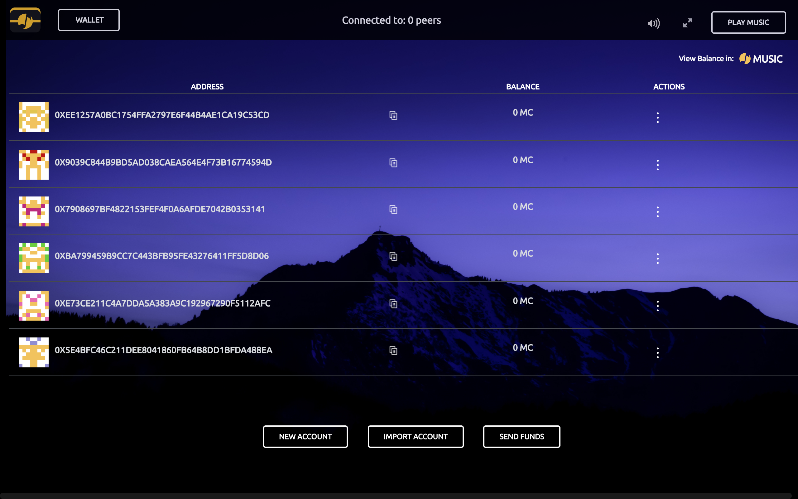

# Musicoin Wallet

The official Musicoin Desktop Wallet

Nightly builds over at https://builder.musicoin.org

## Nightly Builds

Nightly builds for all supported Operating Systems can be found over at [builder.musicoin.org](https://builder.musicoin.org/)

Supported Operating systems:
1. Windows 7 and later - [64 bit](https://builder.musicoin.org/windows-x64.exe), [32bit](https://builder.musicoin.org/windows-x32.exe)
2. macOS - [64 bit](https://builder.musicoin.org/mac-x64.zip)
3. Linux - [64 bit](https://builder.musicoin.org/linux-x64.tar.xz), [32bit](https://builder.musicoin.org/linux-x32.tar.xz)
4. Windows XP and older - [32bit](https://builder.musicoin.org/windows-x32-legacy.exe), [64 bit](https://builder.musicoin.org/windows-x64-legacy.exe)

## Getting started
Prerequisites:
- node >=8.0.0
- yarn >=1.7.0
- bower
- Wine for windows builds on non Windows systems
- upgrade nw.js with `npm install -g nw` (in case there's EACCESS errors, run with `--unsafe-perm=true --allow-root` flags)

## Build Release version

1. `git clone https://github.com/Musicoin/desktop && cd desktop`
2. `yarn`
3. `cd interface ; yarn; cd ..`
4. `nw .`

## Build Alpha version

1. `git clone https://github.com/Musicoin/desktop && cd desktop`
2. `rm package.json` (remove `package.json`) 
3. `mv package-alpha.json package.json` (rename `package-alpha.json` to `package.json`)
4. `yarn`
5. `nw .`

## Packaging the app
1. `git clone https://github.com/Musicoin/desktop && cd desktop`
2. `yarn --link-duplicates`
3. `yarn debug` - This will run in SDK mode for development.
4. `yarn build-all`
      -or-
   `yarn build-x86`
      -or-
   `yarn build-x64`
   to build all packages for Windows, macOS, and Linux. This is meant for testing or development and packaging.
5. `yarn run build -m --x64 ./` - for packaging MacOS x64. `-m`, `-l`, or `-w` determines the os and architecture.

## Testing new interface builds

This repo contains UI modules in accordance with the last release version. To suggest changes, edit the files at `interface/` and issue a PR to the [desktop-interface](https://github.com/Musicoin/desktop-interface) repo.

## Contributing

Pull Requests and Bug Reports are most welcome.

The Wallet repo makes use of the following submodules:
1. [Default UI module](https://github.com/Musicoin/desktop-interface)
2. [`go-musicoin` npm package](https://github.com/Musicoin/gmc-node-modules)
3. [Web3 fork of musicoin](https://github.com/Musicoin/web3.js)

## Bounty program

Specific Issues are earmarked for bounty and carry a bounty label with them. More information regarding the bounty program can be found over at [BOUNTY](docs/BOUNTY.md).

## License

MIT
